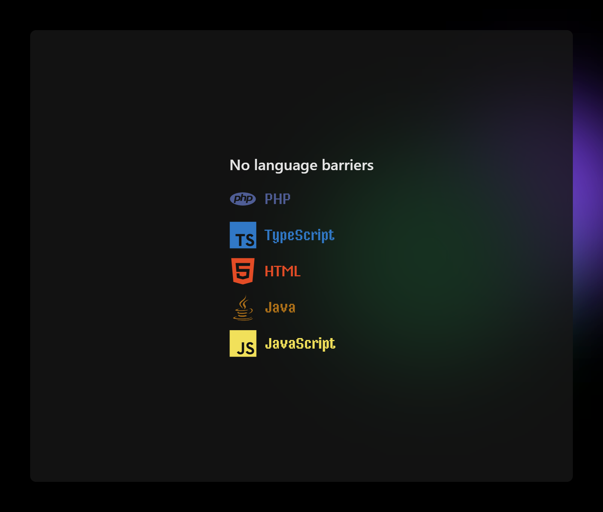
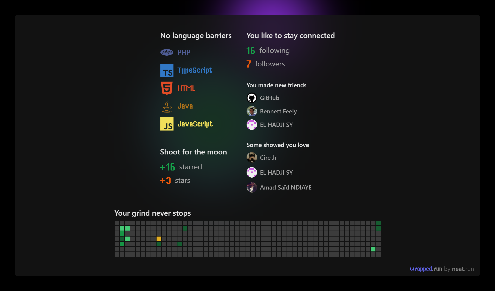
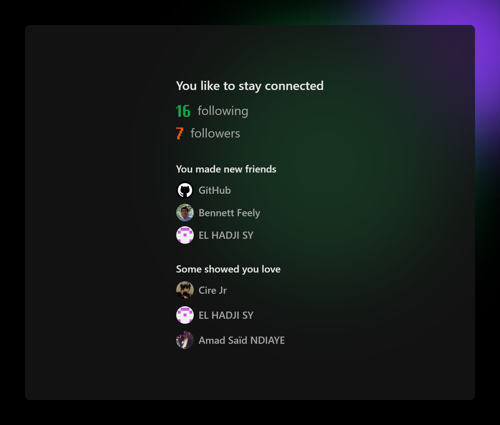
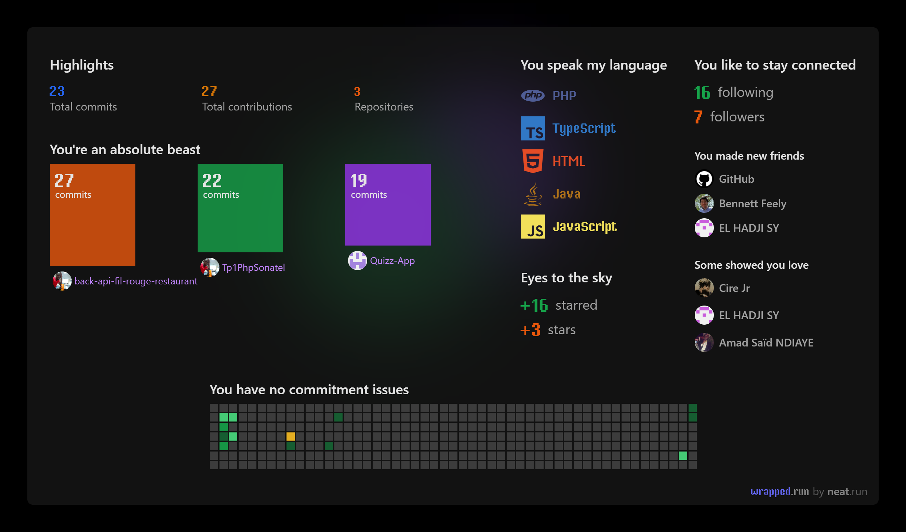

- <h1>👋 Hi, I’m Khadim NIASS ✨ </h1>
- ‍💻 developper ON  
<!--  -->

- 🔭 I’m currently working with `PHP`, `Javascrip`, `integration API`

- 👀💞️ I’m interested in  web developer backend or fullstack

- 👨‍💻 my profile [khadim.live](https://khadim.live#projet)

- ⚡ Fun fact `PHP` , `JavaScript` , `JAVA` , `typescript`

- 📫 How to reach me 
[khadim1.niass@ucad.edu.sn](mailto:khadim1.niass@ucad.edu.sn), 
 [niassssn@gmail.com](mailto:niassssn@gmail.com), 
 [niasskhadim@outlook.com](mailto:niasskhadim@outlook.com)

- 📞 🇸🇳  [+221771958713](tel:+221771958713)

<h3 align="left">Connect with me:</h3>

<!-- 
 -->

 

<h3>LANGAGES AND TOOLS</h3>
<!-- site pour tous les icones -->
<!-- https://github.com/devicons/devicon/tree/master/icons -->

<!-- <svg style="max-width:10%" xmlns="http://www.w3.org/2000/svg" viewBox="0 0 128 128"><path fill="#F34F29" d="M124.737 58.378L69.621 3.264c-3.172-3.174-8.32-3.174-11.497 0L46.68 14.71l14.518 14.518c3.375-1.139 7.243-.375 9.932 2.314 2.703 2.706 3.461 6.607 2.294 9.993l13.992 13.993c3.385-1.167 7.292-.413 9.994 2.295 3.78 3.777 3.78 9.9 0 13.679a9.673 9.673 0 01-13.683 0 9.677 9.677 0 01-2.105-10.521L68.574 47.933l-.002 34.341a9.708 9.708 0 012.559 1.828c3.778 3.777 3.778 9.898 0 13.683-3.779 3.777-9.904 3.777-13.679 0-3.778-3.784-3.778-9.905 0-13.683a9.65 9.65 0 013.167-2.11V47.333a9.581 9.581 0 01-3.167-2.111c-2.862-2.86-3.551-7.06-2.083-10.576L41.056 20.333 3.264 58.123a8.133 8.133 0 000 11.5l55.117 55.114c3.174 3.174 8.32 3.174 11.499 0l54.858-54.858a8.135 8.135 0 00-.001-11.501z"/></svg> -->

